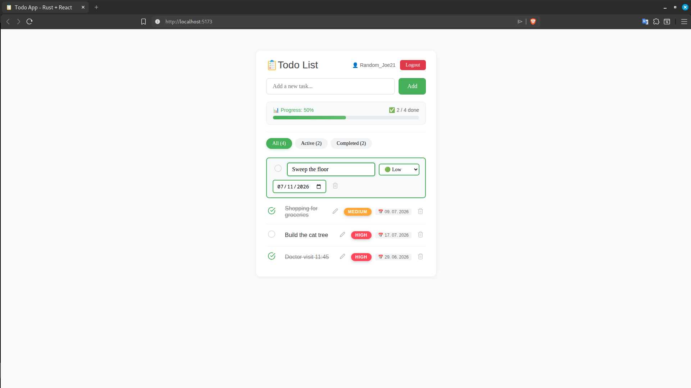

# Rust + React TypeScript Todo App

[](https://opensource.org/licenses/MIT) 
[](https://github.com/Peter-L-SVK/todo-rs)
[](https://github.com/Peter-L-SVK/todo-rs/releases/latest)
[](https://github.com/Peter-L-SVK/todo-rs/commits/main)

Full-stack todo application with Rust (Axum) backend and React TypeScript frontend with Sqlite3 database.
This project serves as learning example and demo for new devs.

 

## Features

- Create, read, update, delete tasks
- Priority levels (Low/Medium/High) with color coding
- Due dates for tasks
- Progress tracking with percentage bar
- Task filtering (All/Active/Completed)
- Inline editing (double-click or edit button)
- User authentication (Register/Login)
- JWT token-based authentication
- Admin panel with React Admin
- Admin-only access to all tasks and users
- CSRF protection
- SQLite database
- Responsive design

## Tech Stack

**Backend:** Rust, Axum, Tokio, SQLx, SQLite, Serde, UUID, Chrono, Validator, Argon2, JSON Web Token

**Frontend:** React 19, TypeScript 5.5, Vite 6.3, Axios, React Icons, React Admin, Material UI

## Project Structure

```
todo-app-rs/
├── backend/
│   ├── src/
│   │   ├── main.rs          # Entry point
│   │   ├── database.rs      # DB connection
│   │   ├── models.rs        # Data models
│   │   ├── routes.rs        # API routes
│   │   └── auth.rs          # Authentication (JWT, password hashing)
│   ├── migrations/          # SQL migrations
│   │   ├── 20240610000000_create_tasks.sql
│   │   ├── 20240610000001_create_users.sql
│   │   ├── 20240612000000_add_indexes.sql
│   │   └── 20240613000000_add_user_id_to_tasks.sql
│   ├── .env                 # Environment variables
│   └── Cargo.toml
└── frontend/
    ├── src/
    │   ├── api/
    │   │   ├── tasksApi.ts  # Task API calls
    │   │   ├── authApi.ts   # Authentication API calls
    │   │   └── adminDataProvider.ts  # React Admin data provider
    │   ├── components/
    │   │   ├── admin/       # Admin panel components
    │   │   │   ├── Dashboard.tsx
    │   │   │   ├── TaskList.tsx
    │   │   │   ├── TaskEdit.tsx
    │   │   │   └── UserList.tsx
    │   │   ├── TaskList.tsx
    │   │   ├── TaskForm.tsx
    │   │   ├── TaskItem.tsx
    │   │   ├── TaskFilters.tsx
    │   │   ├── TasksContainer.tsx
    │   │   ├── Login.tsx
    │   │   ├── Register.tsx
    │   │   └── Admin.tsx
    │   ├── types/
    │   │   └── task.types.ts
    │   ├── App.tsx
    │   └── main.tsx
    ├── package.json
    └── tsconfig.json
```

## Setup

### Backend

```bash
cd backend

# Create .env file with database and JWT secret
echo "DATABASE_URL=sqlite:todo.db" > .env
echo "JWT_SECRET=your-super-secret-key-change-in-production" >> .env

# Create empty database
sqlite3 todo.db "VACUUM;"

# Run database migrations
sqlx migrate run

# Start the server
cargo run
# Server: http://localhost:8000
```

### Frontend

```bash
cd frontend

# Install dependencies
npm install

# Start development server
npm run dev
# App: http://localhost:5173
```

## API Endpoints

### Authentication

| Method | Endpoint | Description |
|--------|----------|-------------|
| POST | `/api/auth/register` | Register new user |
| POST | `/api/auth/login` | Login and get JWT token |
| GET | `/api/auth/me` | Get current user info (requires token) |

### Tasks (require authentication)

| Method | Endpoint | Description |
|--------|----------|-------------|
| GET | `/api/csrf` | Get CSRF token |
| GET | `/api/tasks` | Get user's tasks |
| POST | `/api/tasks` | Create task |
| PATCH | `/api/tasks/{id}` | Update task |
| DELETE | `/api/tasks/{id}` | Delete task |

### Admin (requires admin role)

| Method | Endpoint | Description |
|--------|----------|-------------|
| GET | `/api/admin/tasks` | Get all tasks from all users |
| GET | `/api/admin/users` | Get all users |
| GET | `/api/users` | Get all users (React Admin) |

### Data Models

```typescript
// Task
Task {
  id: string
  title: string
  completed: boolean
  priority?: "low" | "medium" | "high"
  due_date?: string  // YYYY-MM-DD
  user_id: string
  created_at: number
}

// User
User {
  id: string
  username: string
  email: string
  role: "user" | "admin"
}

// Authentication
RegisterRequest {
  username: string
  email: string
  password: string  // min 8 characters
}

LoginRequest {
  email: string
  password: string
}
```

## Testing

### Backend Tests (Rust)

Run all backend unit and integration tests:

```bash
cd backend
cargo test
```

Run specific test:

```bash
cargo test test_create_and_get_task
```

Run tests with output:

```bash
cargo test -- --nocapture
```

**Test Coverage:**

| Test | Description |
|------|-------------|
| `test_api_response_success` | ApiResponse success format |
| `test_api_response_error` | ApiResponse error format |
| `test_create_task_valid` | Valid task validation |
| `test_create_task_empty_title` | Empty title validation |
| `test_create_task_title_too_long` | Title length validation |
| `test_create_pool` | Database connection |
| `test_pool_connections` | Connection pool |
| `test_create_and_get_task` | Create + fetch task |
| `test_update_task` | Update task |
| `test_delete_task` | Delete task |
| `test_delete_nonexistent_task` | Delete non-existent task |
| `test_create_task_with_priority` | Create task with priority |
| `test_create_task_with_due_date` | Create task with due date |

### Frontend Tests (React + Vitest)

Run all frontend tests:

```bash
cd frontend
npm run test
```

Run tests in watch mode:

```bash
npm run test -- --watch
```

Run tests with coverage:

```bash
npm run test -- --coverage
```

**Test Coverage:**

| Test | Description |
|------|-------------|
| `TaskItem` | Rendering, edit mode, toggle, delete |
| `TaskList` | Loading, filtering, add, toggle, delete |

### API Testing with curl

```bash
# 1. Register a new user
curl -X POST http://localhost:8000/api/auth/register \
  -H "Content-Type: application/json" \
  -d '{"username":"testuser","email":"test@example.com","password":"password123"}'

# 2. Login and get JWT token
TOKEN=$(curl -s -X POST http://localhost:8000/api/auth/login \
  -H "Content-Type: application/json" \
  -d '{"email":"test@example.com","password":"password123"}' \
  | grep -o '"token":"[^"]*"' | cut -d'"' -f4)

# 3. Get CSRF token (using the JWT token)
CSRF_TOKEN=$(curl -s -X GET http://localhost:8000/api/csrf \
  -H "Authorization: Bearer $TOKEN" \
  | grep -o '"csrfToken":"[^"]*"' | cut -d'"' -f4)

# 4. Create a task
curl -X POST http://localhost:8000/api/tasks \
  -H "Content-Type: application/json" \
  -H "Authorization: Bearer $TOKEN" \
  -H "X-CSRF-Token: $CSRF_TOKEN" \
  -d '{"title":"Learn Rust","priority":"high"}'

# 5. Get all tasks
curl -X GET http://localhost:8000/api/tasks \
  -H "Authorization: Bearer $TOKEN"

# 6. Update task (replace {id} with actual task ID)
curl -X PATCH http://localhost:8000/api/tasks/{id} \
  -H "Content-Type: application/json" \
  -H "Authorization: Bearer $TOKEN" \
  -H "X-CSRF-Token: $CSRF_TOKEN" \
  -d '{"completed":true}'

# 7. Delete task (replace {id} with actual task ID)
curl -X DELETE http://localhost:8000/api/tasks/{id} \
  -H "Authorization: Bearer $TOKEN" \
  -H "X-CSRF-Token: $CSRF_TOKEN"
```

### API Testing with Postman

1. Import the collection (optional)
2. Set environment variable: `base_url = http://localhost:8000`
3. Test endpoints in this order:
   1. `POST /api/auth/register` - Create account
   2. `POST /api/auth/login` - Get JWT token
   3. `GET /api/csrf` - Store CSRF token
   4. `POST /api/tasks` - Create task
   5. `GET /api/tasks` - Get all tasks
   6. `PATCH /api/tasks/{id}` - Update task
   7. `DELETE /api/tasks/{id}` - Delete task

**Postman Headers:**
```
Content-Type: application/json
Authorization: Bearer {{jwt_token}}
X-CSRF-Token: {{csrf_token}}
```

### Linting

```bash
cd frontend
npm run lint
```

## Database Schema

### Tasks Table
```sql
CREATE TABLE tasks (
    id TEXT PRIMARY KEY,
    title TEXT NOT NULL,
    completed BOOLEAN DEFAULT 0,
    priority TEXT DEFAULT 'medium',
    due_date TEXT,
    user_id TEXT NOT NULL,
    created_at TEXT NOT NULL
);

CREATE INDEX idx_tasks_user_id ON tasks(user_id);
CREATE INDEX idx_tasks_completed ON tasks(completed);
CREATE INDEX idx_tasks_priority ON tasks(priority);
CREATE INDEX idx_tasks_created_at ON tasks(created_at DESC);
```

### Users Table
```sql
CREATE TABLE users (
    id TEXT PRIMARY KEY,
    username TEXT NOT NULL UNIQUE,
    email TEXT NOT NULL UNIQUE,
    password_hash TEXT NOT NULL,
    role TEXT DEFAULT 'user',
    created_at TEXT NOT NULL
);

CREATE INDEX idx_users_email ON users(email);
CREATE INDEX idx_users_username ON users(username);
```

## Environment Variables

### Backend (`.env`)
```env
DATABASE_URL=sqlite:todo.db
JWT_SECRET=your-super-secret-key-change-in-production
```

### Frontend (`.env`)
```env
VITE_API_URL=http://localhost:8000
```

## Development Commands

### Backend
```bash
cargo run              # Run server
cargo build --release  # Build release
cargo test             # Run tests
sqlx migrate run       # Run migrations
```

### Frontend
```bash
npm run dev       # Development
npm run build     # Production build
npm run preview   # Preview build
npm run test      # Run tests
npm run lint      # Run ESLint
npx tsc --noEmit  # Type check
```

## Admin Panel

The application includes a full admin panel built with React Admin:

- Accessible at `/admin` (only for users with `admin` role)
- Manage all tasks from all users
- Manage all users
- Dashboard with statistics
- Auto-hide navigation bar on scroll
- Dark theme matching the application style

### Creating an Admin User

```bash
cd backend
sqlite3 todo.db

# Create admin user (password: admin123)
INSERT INTO users (id, username, email, password_hash, role, created_at) 
VALUES (
    'admin-001',
    'admin',
    'admin@example.com',
    '$argon2id$v=19$m=4096,t=3,p=1$...',  # Use your generated hash
    'admin',
    datetime('now')
);
```

## Security Features

- **JWT Authentication** - Stateless token-based authentication
- **Password Hashing** - Argon2 for secure password storage
- **CSRF Protection** - Prevents cross-site request forgery
- **CORS Configuration** - Secure frontend-backend communication
- **Input Validation** - Server-side validation for all inputs
- **Role-based Access Control** - Admin-only endpoints and UI

## Roadmap

- [x] Isolated per user tasks
- [x] React-admin integration
- [ ] Password reset functionality
- [ ] Email verification
- [ ] User profile management
- [ ] Task sharing
- [ ] Dark mode
- [ ] Drag and drop reordering
- [ ] Task search
- [ ] Pagination

## Contributing

1. Fork the repository
2. Create feature branch
3. Make changes
4. Submit pull request

Keep changes:
- Type-safe (TypeScript strict mode)
- Error handled
- Consistent API responses
- Well commented

## License

MIT License - See [LICENSE](LICENSE) for details.

## Author

**Peter Leukanič** - [@Peter-L-SVK](https://github.com/Peter-L-SVK)

## Acknowledgments

- [Axum](https://github.com/tokio-rs/axum) - Web framework for Rust
- [SQLx](https://github.com/launchbadge/sqlx) - Async SQL toolkit
- [React](https://reactjs.org/) - UI library
- [TypeScript](https://www.typescriptlang.org/) - Typed JavaScript
- [Vite](https://vitejs.dev/) - Build tool
- [React Admin](https://marmelab.com/react-admin/) - Admin panel framework

---
